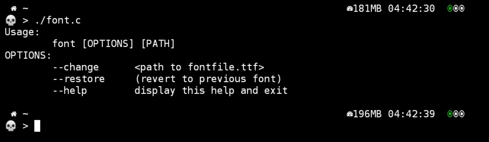

## Font

Fonts are a really important part of the user experience.


# Requirements
```bash
apt install git 
```

# Installation
```bash
git clone https://github.com/VictorH028/font.git 
```
```bash
cd font
```
You can compete with the compilation that you like the most

```bash
clang++ font.cpp -o font
```
```bash
mv font $PREFIX/bin/
```



You can get totally free font from the following link

https://fontmeme.com/fuentes/fuente-gimp-mousewriting/

# nota 
restart the terminal to load the changes
```bash
termux-reload-settings
```
